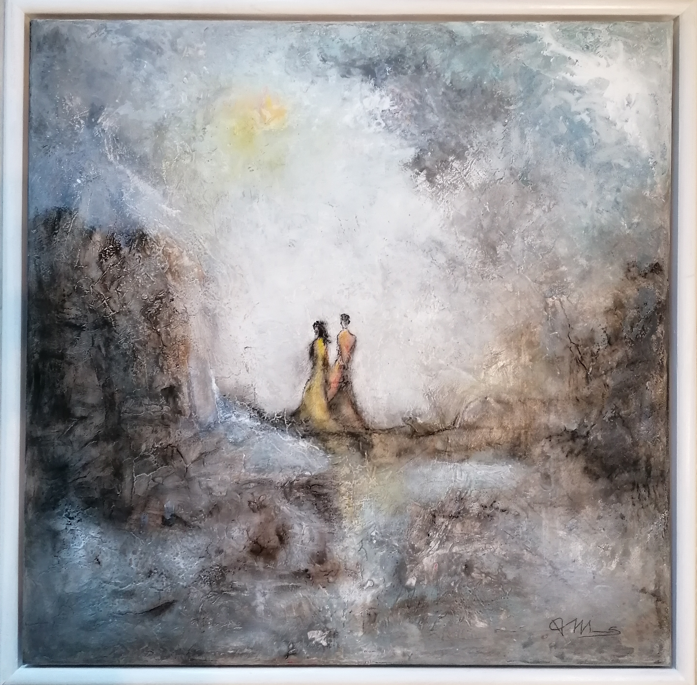
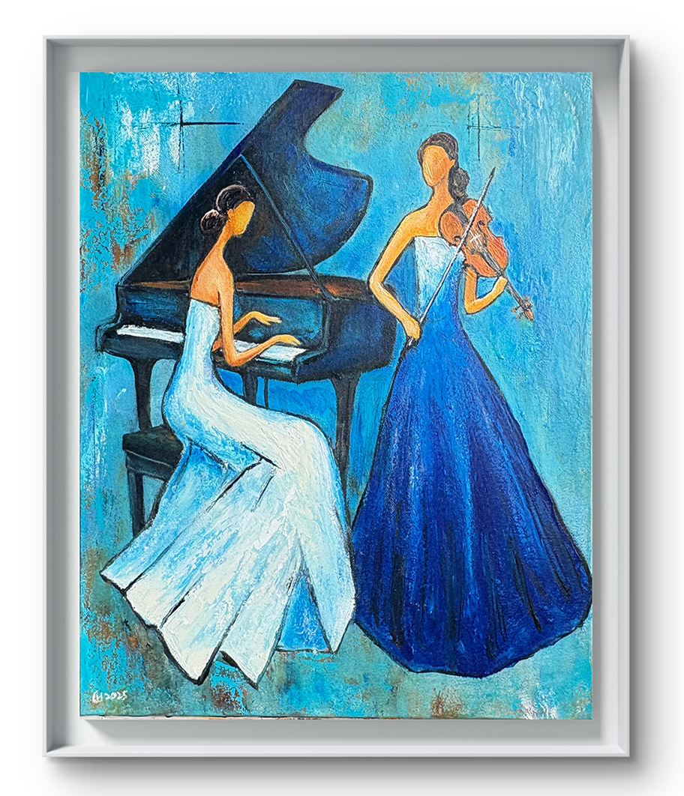
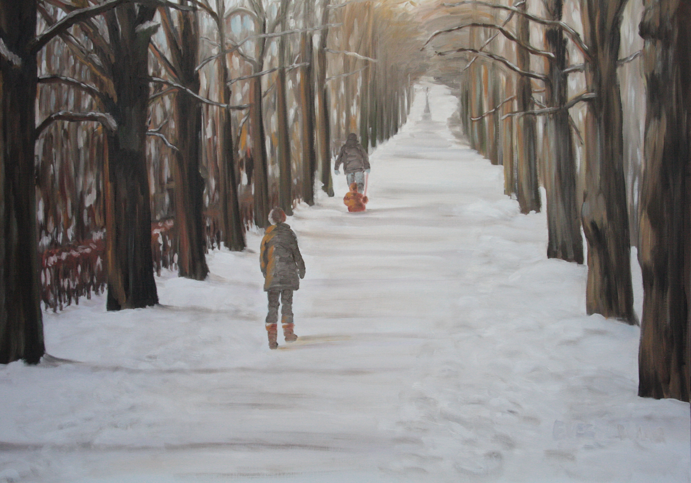
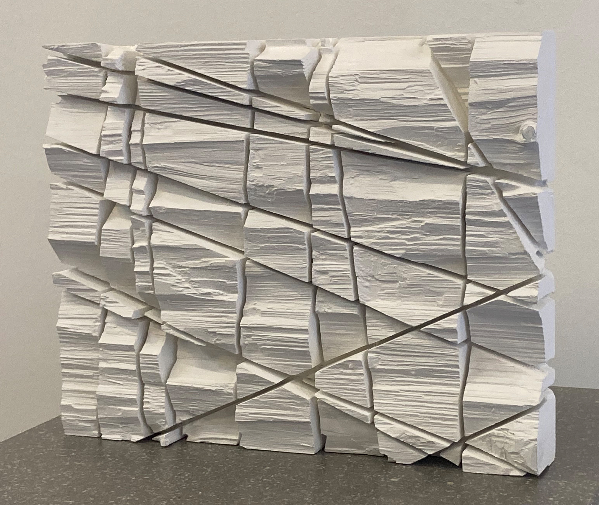
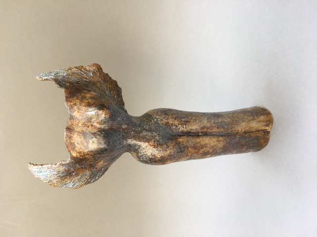
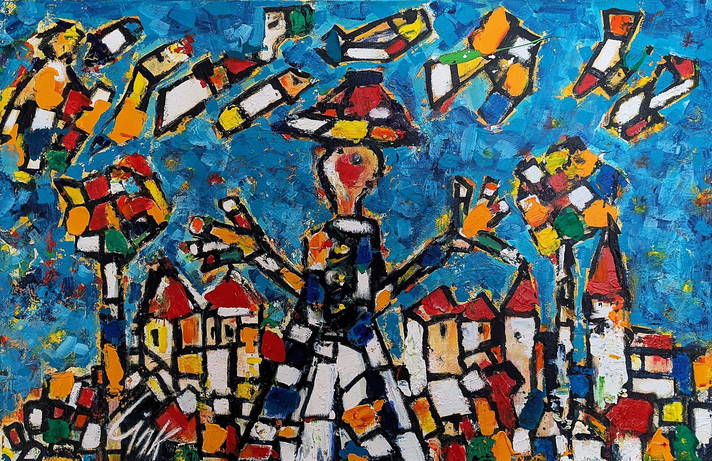

## Adventskalender 2025

Kunst aus Kitzingen und drum herum...

---- 
### 10. Türchen

  

"*Spaziergang*"  
Acrylfarben, Strukturpaste, Pigmente, Kreide auf Leinwand,  
mit weißen Holzrahmen, 60 x 60 cm  
Preis: 400,- €  

Kontakt-Email: gabriele_vollhals (at) web.de

---- 
### 9. Türchen

  

"*Sonata Blu*"   
von Huang Claire  
Acryl auf Leinwand, 40 × 50 cm  
250,- € ohne Rahmen  

"Sonata Blu" ist eine poetische Hommage an die Harmonie zwischen Musik und Malerei. In einem Meer aus sanften Blau- und Türkistönen begegnen sich zwei Musikerinnen: die Pianistin in ruhiger, fließender Bewegung, die Violinistin in aufrechter, klarer Eleganz. Die Komposition verbindet Stille und Klang – als würde die Leinwand selbst zu einem Konzertsaal werden. Die rhythmischen Pinselstriche, die feinen Lichtakzente und die abstrahierten Figuren schaffen eine Atmosphäre voller Anmut, Konzentration und
innerer Resonanz.  

Kontakt-Email: clairepink1204 (at) yahoo.com.tw  

---- 
### 8. Türchen

  

"*Engel der Freude*"  
von Ulla Leuchtkraft  
Öllasuren auf Leinwand, 60 x 30 cm  
285,- €  

Kontakt-Email: ulla.leuchtkraft (at) t-online.de

---- 
### 7. Türchen

  

"*Winterspaziergang*"  
von Elisabeth Versl-Waag  
Öl auf Leinwand, 80 x 100 cm  

Kontakt-Email: e.versl.waag (at) googlemail.com  

----
### 6. Türchen

  

"*Einschnitte*"  
von Claus Peter Berneth  
290,- € in weiß  
390,- € in schwarz  

Einschnitte sind oft verletzend, hart und scharf. Einschnitte prägen aber auch, ergeben oft definierte Strukturen. Claus Peter Berneth verwendet bewusst die Kreissäge, um klare Einschnitte zu realisieren. Faserbrüche im Holz lassen raue und markante Oberflächenstrukturen entstehen. Durch Einfärbung lässt sich die Dynamik der Strukturen steigern und individualisieren.

Kontakt-Email: c.berneth (at) gmx.de  

----
### 5. Türchen

  

"*Engelsgleich*"  
von Brigitte Klussmeier   
Ton, aufwändig glasiert, hochgebrannt  
300,- €  

Kontakt-Email: Brigitte.Klussmeier (at) gmx.de

---- 
### 4. Türchen

  

"*Panta Rhei*"  
von Susanne Karres  
Mischtechnik, 150 x 100 cm  
1.500,- €  
  
Kontakt-Email: skkarres (at) gmx.de  

---- 
### 3. Türchen

"*Eiskinder*"  
Haiga von Gabriele Brunsch  
  
Was ist bitteschön ein Haiga? Natürlich ein Haiku, in einem Bild.  
  
Kontakt-Email: Gabriele.Brunsch (at) t-online.de  
(Gabriele Brunsch Papiertheater Kitzingen)  

---- 
### 2. Türchen

"*Weihnacht*"  
von Susanne Leifeld  
Aquarell, 30 x 40 cm      
120,- € im Passepartout  
150,- € mit Rahmen  

Kontakt-Email: info (at) peanut-gallery.de  

----
### 1. Türchen

"*Hadeloga*"  
von Herbert Link    
Acrylfarben auf Leinwand, 116 x 75 cm    

Kitzingen in voller Pracht. Hadeloga, mit Schäfer Kitz, sowie seinen Schafen.  

Kontakt-Email: linkherbert (at) yahoo.de  

----
