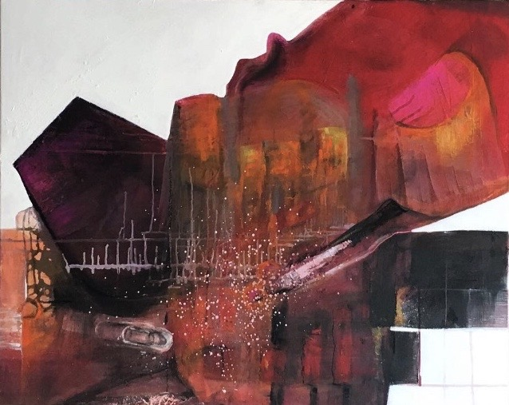
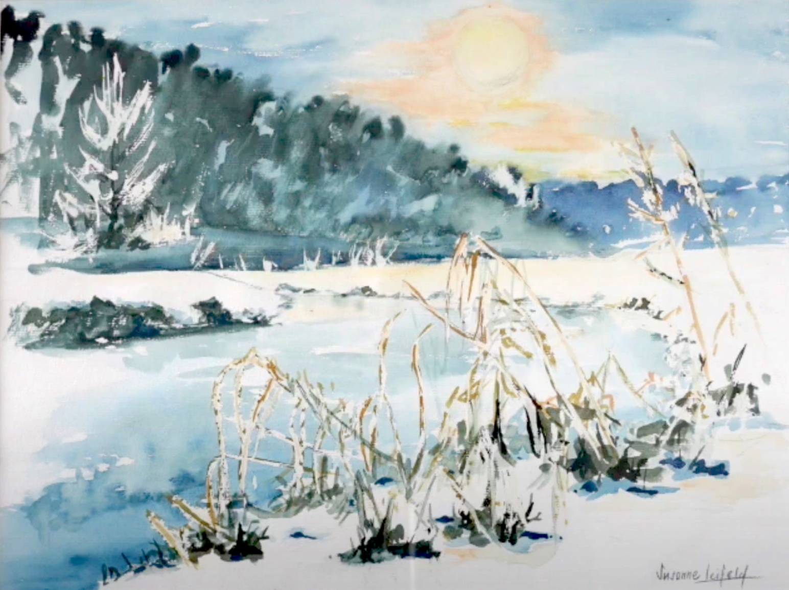
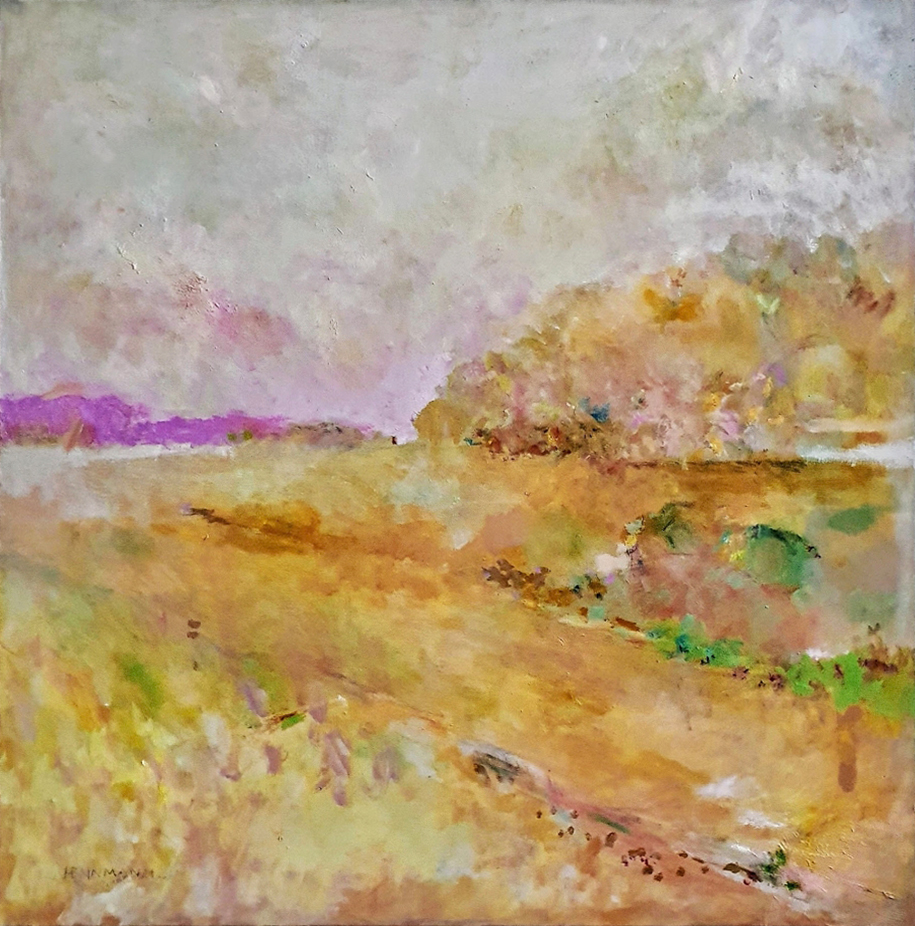
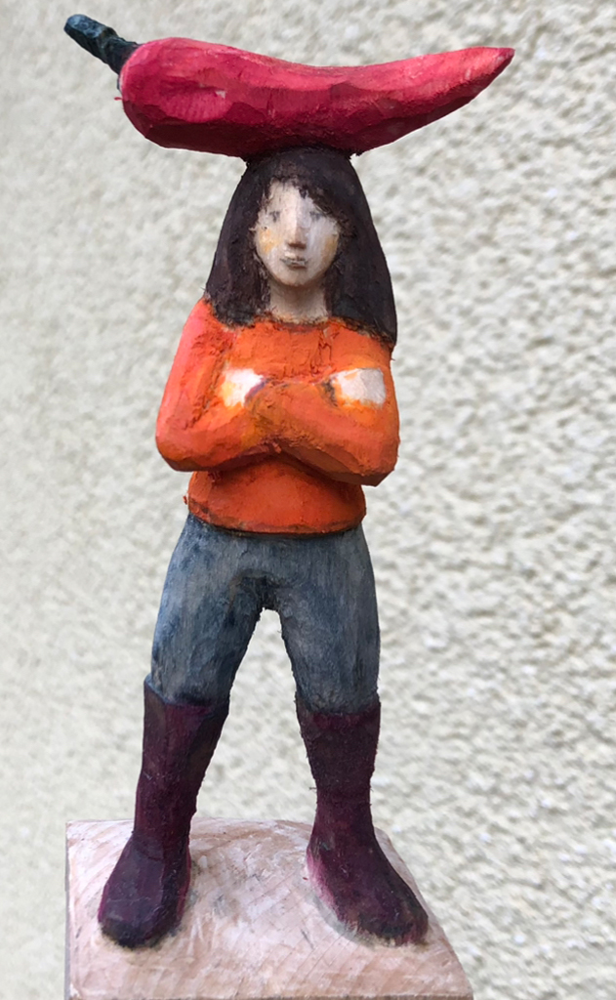
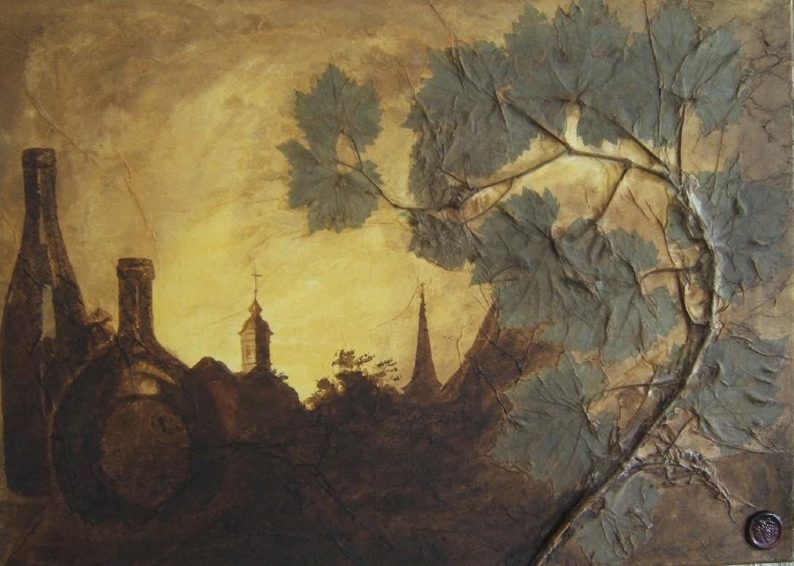
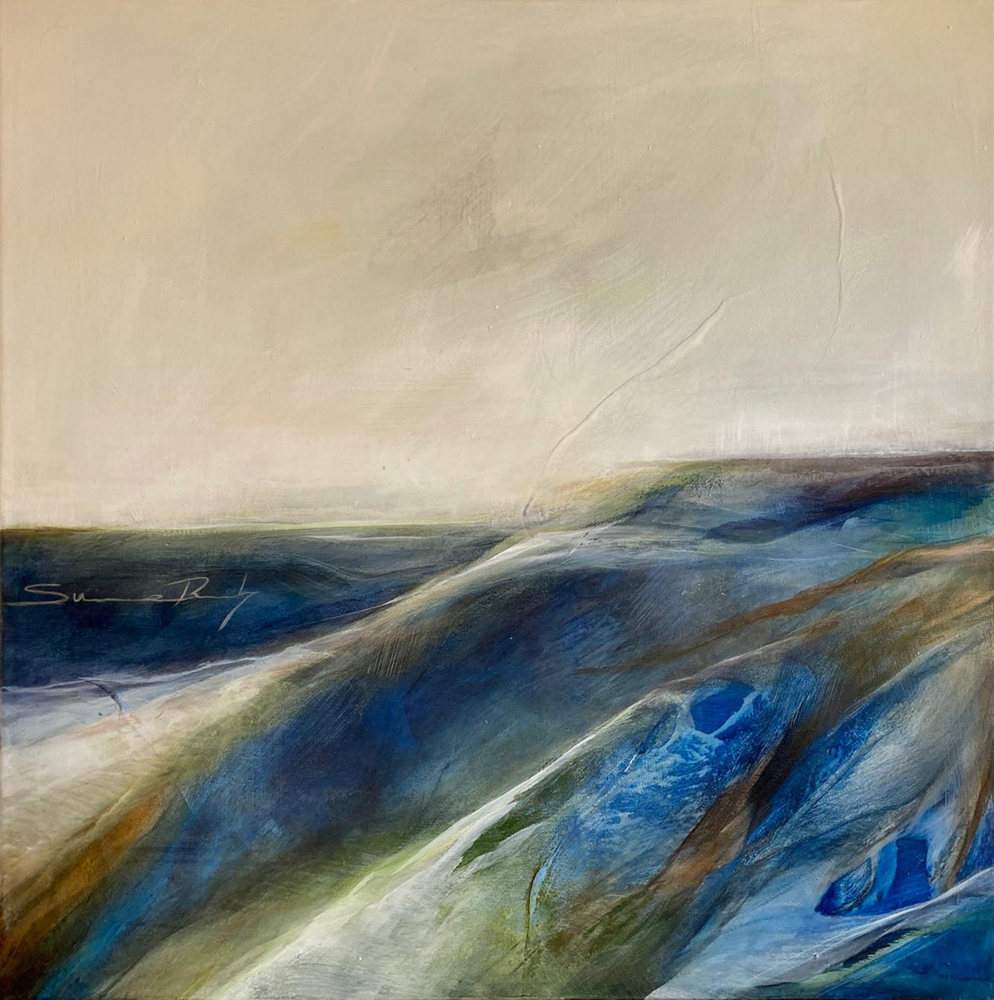
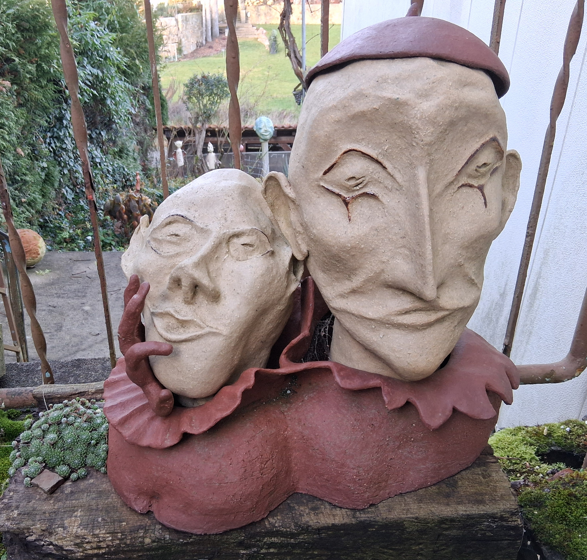
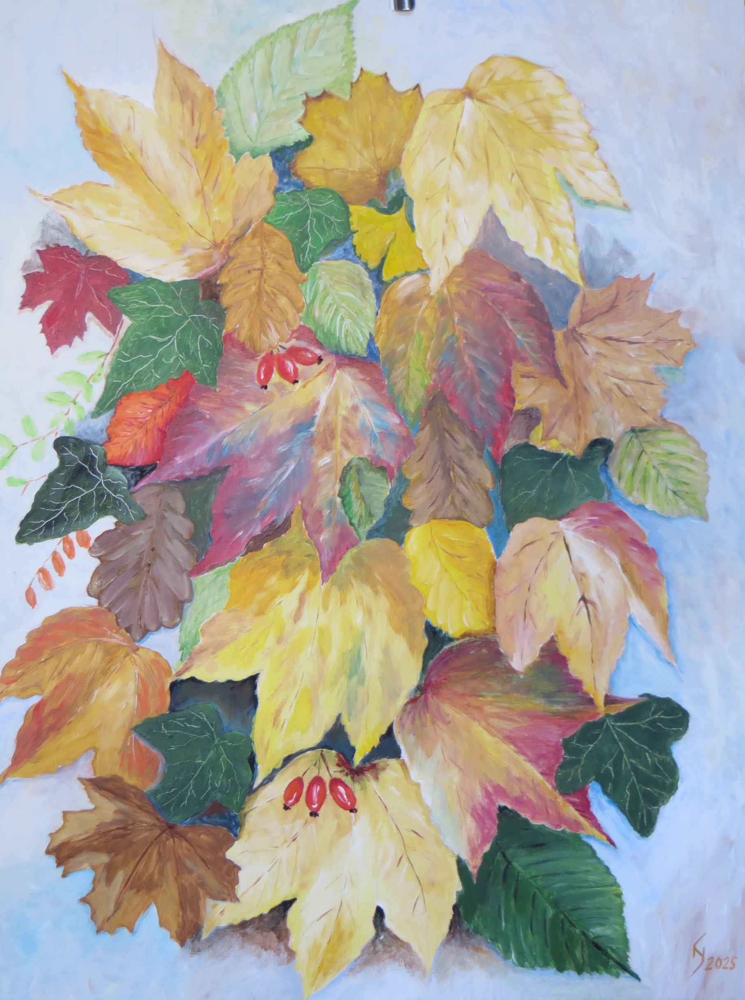

## Adventskalender 2025

Kunst aus Kitzingen und drum herum...

----
### 23. Türchen

  

"*Weihnachtspastorale*"  
von Carmen Jung  
100 x 80 cm  

Kontakt-Email: jungcarmen (at) me.com  

----
### 22. Türchen

  

"*Gottvertrauen*"  
von Brigitte Klussmeier   
Ton mit Zellulose auf Stahlgewebe montiert, aufwändige Oberflächenbehandlung, u. a. mit Porzellan  

Kontakt-Email: Brigitte.Klussmeier (at) gmx.de

---- 
### 21. Türchen

  

"*Winterlandschaft*"  
von Susanne Leifeld  
Aquarell  

Kontakt-Email: info (at) peanut-gallery.de

----
### 20. Türchen

  

"*Der Clown*"  
von Herbert Link    
Acrylfarben auf Leinwand, 40 x 40 cm  
200,- €  

Kontakt-Email: linkherbert (at) yahoo.de  

---- 
### 19. Türchen

  

"*ZART I*"  
von Helmut Nennmann  
Öl auf Leinwand, 100 x 100 cm  
1.200,- €  

Kontakt-Email: helmut (at) atelier-nennmann.de  

---- 
### 18. Türchen

  

"*Chili Lilli*"  
von Heike Anja Häberlein  
Geschnitzt aus Lindenholz, mit Aquarellfarbe bemalt  
Figur (ohne Sockel) ca 13 cm x 5 cm x 2,5 cm  
395,- €  

Kontakt-Email: heikeanja (at) t-online.de

---- 
### 17. Türchen

  

"*Frohe Botschaft*"  
von Anja Karres  
Acryl auf Holz im Goldrahmen, 30 x 40 cm  

Kontakt-Email: anja.karres (at) gmx.de  

---- 
### 16. Türchen

  

"*Buchbrunn*"  
von Harald Wirkner  
Mischtechnik, Weinlaub überzogen mit Chinapapier, mit übermalt Acryl  
(bereits verkauft)  

Kontakt-Email: bauhaus_team (at) web.de

---- 
### 15. Türchen

  

"*longing*"  
von Susanne Braterschofsky  
Gemälde, 80 x 80 cm  
800,- €  

Kontakt-Email: ateliermaindesign (at) gmail.com

---- 
### 14. Türchen

  

"*Zwei Seelen in einer Brust*"      
von Monica Kaiser  
Keramik für den Garten  
260,- €  

Kontakt-Email: monica (at) hertschi.de  

---- 
### 13. Türchen

  

"*Aufgewühlt*"  
von Michael Hofmann  
Farbfotografie, 60 x 80 cm  
120,- €  

Kontakt-Email: atelier (at) NoART.photography  
Homepage: [Michas Atelier](https://www.NoART.photography)  

---- 
### 12. Türchen

  

"*Herbst*"  
von Klaus Schneider  
Acryl auf Hartfaser, 60 x 80 cm  

Kontakt-Email: atelierklaus (at) aol.com  
Homepage: [Atelier Klaus Schneider](https://www.atelier-klausschneider.de)  

---- 
### 11. Türchen

  

"*Bernsteinblick*"  
von Anita Scheidig  
Kohle/Aquarell, 30 x 40 cm  
150,00 € mit schwarzem Rahmen  

Kontakt-Email: scheidig.art (at) gmail.com  

---- 
### 10. Türchen

  

"*Spaziergang*"  
von Gabriele Vollhals  
Acrylfarben, Strukturpaste, Pigmente, Kreide auf Leinwand,  
mit weißen Holzrahmen, 60 x 60 cm  
Preis: 400,- €  

Kontakt-Email: gabriele_vollhals (at) web.de

---- 
### 9. Türchen

  

"*Sonata Blu*"   
von Huang Claire  
Acryl auf Leinwand, 40 × 50 cm  
250,- € ohne Rahmen  

"Sonata Blu" ist eine poetische Hommage an die Harmonie zwischen Musik und Malerei. In einem Meer aus sanften Blau- und Türkistönen begegnen sich zwei Musikerinnen: die Pianistin in ruhiger, fließender Bewegung, die Violinistin in aufrechter, klarer Eleganz. Die Komposition verbindet Stille und Klang – als würde die Leinwand selbst zu einem Konzertsaal werden. Die rhythmischen Pinselstriche, die feinen Lichtakzente und die abstrahierten Figuren schaffen eine Atmosphäre voller Anmut, Konzentration und
innerer Resonanz.  

Kontakt-Email: clairepink1204 (at) yahoo.com.tw  

---- 
### 8. Türchen

  

"*Engel der Freude*"  
von Ulla Leuchtkraft  
Öllasuren auf Leinwand, 60 x 30 cm  
285,- €  

Kontakt-Email: ulla.leuchtkraft (at) t-online.de

---- 
### 7. Türchen

  

"*Winterspaziergang*"  
von Elisabeth Versl-Waag  
Öl auf Leinwand, 80 x 100 cm  

Kontakt-Email: e.versl.waag (at) googlemail.com  

----
### 6. Türchen

  

"*Einschnitte*"  
von Claus Peter Berneth  
290,- € in weiß  
390,- € in schwarz  

Einschnitte sind oft verletzend, hart und scharf. Einschnitte prägen aber auch, ergeben oft definierte Strukturen. Claus Peter Berneth verwendet bewusst die Kreissäge, um klare Einschnitte zu realisieren. Faserbrüche im Holz lassen raue und markante Oberflächenstrukturen entstehen. Durch Einfärbung lässt sich die Dynamik der Strukturen steigern und individualisieren.

Kontakt-Email: c.berneth (at) gmx.de  

----
### 5. Türchen

  

"*Engelsgleich*"  
von Brigitte Klussmeier   
Ton, aufwändig glasiert, hochgebrannt  
300,- €  

Kontakt-Email: Brigitte.Klussmeier (at) gmx.de

---- 
### 4. Türchen

  

"*Panta Rhei*"  
von Susanne Karres  
Mischtechnik, 150 x 100 cm  
1.500,- €  
  
Kontakt-Email: skkarres (at) gmx.de  

---- 
### 3. Türchen

"*Eiskinder*"  
Haiga von Gabriele Brunsch  
  
Was ist bitteschön ein Haiga? Natürlich ein Haiku, in einem Bild.  
  
Kontakt-Email: Gabriele.Brunsch (at) t-online.de  
(Gabriele Brunsch Papiertheater Kitzingen)  

---- 
### 2. Türchen

"*Weihnacht*"  
von Susanne Leifeld  
Aquarell, 30 x 40 cm      
120,- € im Passepartout  
150,- € mit Rahmen  

Kontakt-Email: info (at) peanut-gallery.de  

----
### 1. Türchen

"*Hadeloga*"  
von Herbert Link    
Acrylfarben auf Leinwand, 116 x 75 cm    

Kitzingen in voller Pracht. Hadeloga, mit Schäfer Kitz, sowie seinen Schafen.  

Kontakt-Email: linkherbert (at) yahoo.de  

----
